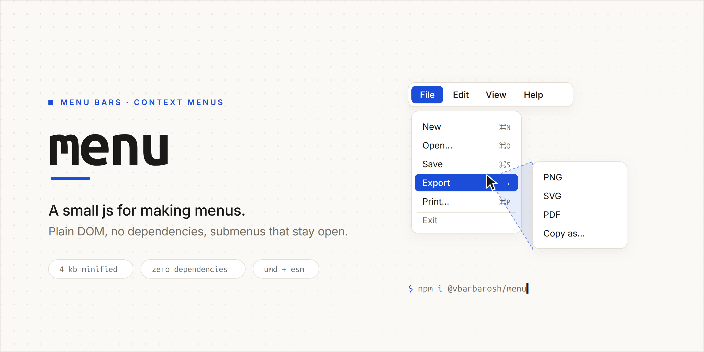

<picture>
  <source media="(prefers-color-scheme: dark)" srcset="img/cover-dark.png">
  
</picture>

# `menu`

A small js for making menus: a menu bar and a context menu, over plain
`<ul>`/`<li>` markup. Plain DOM, no dependencies, under 4 KB minified.

* Nested submenus to any depth; an empty `<li>` is a separator.
* A submenu stays open while the pointer heads for it, even when the way
  crosses other rows (the hover triangle every desktop menu has).
* You style it: the library only toggles `open` and `hover` classes and
  positions submenus; `theme-flat.css` is one look, not the look.

Demos: [menu bar](https://vbarbarosh.github.io/menu/demos/menu_1_hello.html) ·
[context menu](https://vbarbarosh.github.io/menu/demos/contextmenu_1_hello.html)

## Installation

    npm i @vbarbarosh/menu

```js
import menu from '@vbarbarosh/menu';
import contextmenu from '@vbarbarosh/menu/src/contextmenu.js';
```

Or from a `<script>` tag — each file defines one global, `menu` or
`contextmenu`:

    <script src="https://unpkg.com/@vbarbarosh/menu@0.2.0/dist/menu.js"></script>
    <script src="https://unpkg.com/@vbarbarosh/menu@0.2.0/dist/contextmenu.js"></script>

## Markup

A menu is a `<ul>`. A row is an `<li>`; a row with a `<ul>` inside opens it
as a submenu; an empty `<li>` is a separator. The library adds `open` to a row
whose submenu is shown and `hover` to the row under the pointer, and sets
`top`/`left` on a submenu it shows.

    <link href="https://unpkg.com/@vbarbarosh/menu@0.2.0/dist/theme-flat.css" rel="stylesheet">

    <ul id="main" class="menu-flat">
        <li>
            File
            <ul>
                <li data-action="open">Open</li>
                <li data-action="save">Save</li>
                <li></li>
                <li data-action="exit">Exit</li>
            </ul>
        </li>
        <li>
            Edit
            <ul>
                <li data-action="undo">Undo</li>
                <li data-action="redo">Redo</li>
            </ul>
        </li>
        <li data-action="help">Help</li>
    </ul>

## Menu bar

`menu(elem, options)` turns a `<ul>` into a menu bar: a click on a top row
opens it, a hover moves between rows and submenus, a click on a leaf row or
outside the menu closes everything. What a click does is up to you — listen
for it on the element:

```js
const inst = menu(document.getElementById('main'));

document.getElementById('main').addEventListener('click', function (event) {
    if (event.target.dataset.action) {
        console.log('click', event.target.dataset.action);
    }
});

inst.hide();   // close whatever is open
inst.end();    // remove the document listeners
```

A `<ul data-menu-keepalive>` submenu stays open after one of its rows is
clicked (a zoom menu, a list of toggles).

## Context menu

`contextmenu(elem, x, y, options)` shows a `<ul>` at a point, usually from a
`contextmenu` event, and returns `{promise, end}`. The promise resolves with
the clicked `<li>`, or `null` when the menu was dismissed by a click outside:

```js
document.addEventListener('contextmenu', async function (event) {
    event.preventDefault();
    const li = await contextmenu(document.getElementById('ctx'), event.clientX, event.clientY).promise();
    if (li) {
        console.log('chosen', li.dataset.action);
    }
});
```

The element is shown in place: give it `position: fixed` in your stylesheet
(`theme-flat.css` does with `class="menu-flat menu-flat-context"`, a root
that looks like a submenu) and hide it with an inline `style="display: none"`,
since the library shows and hides it by that inline style. The menu flips to
the other side of the point when it would leave the window, and so do its
submenus.

## Options

Both take the same options:

| option | default | |
|---|---|---|
| `grace_ms` | `300` | how long a row under the pointer waits before it takes an open submenu over, while the pointer is on its way to that submenu |

## Development

    npm test        # mocha on jsdom
    npm run build   # dist/ via webpack
    bin/release patch|minor|major

Node 20 or newer for the toolchain; the library itself runs in any browser
with `Element.closest`.

## Links

* [Menu | jQuery UI](https://jqueryui.com/menu/)
* [jQuery-menu-aim](https://github.com/kamens/jQuery-menu-aim)
* [Menu - Metro 4 :: Popular HTML, CSS and JS library](https://metroui.org.ua/menu.html)
* [A user interface algorithm in the menu? · Raygun Blog](https://raygun.com/blog/algorithm-menu-2/)
* [Dropdown Menus with More Forgiving Mouse Movement Paths](https://css-tricks.com/dropdown-menus-with-more-forgiving-mouse-movement-paths/)
* [vue-context](https://github.com/rawilk/vue-context)
